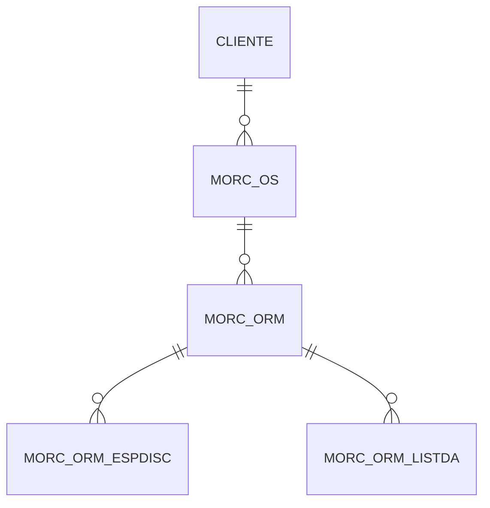

# Importação do Excel de Documentos e Atividades

## 1. Descrição

Cadastro de novos documentos ou atividades na Lista de Documentos e Atividades (LD/LA) no ELFA.

### 1.1. Termos utilizados

| Termo | Definição                        |
| ----- | -------------------------------- |
| FCE   | Fase de Conhecimento de Escopo   |
| LDLA  | Lista de Documentos e Atividades |
| DA    | Documento(s) e Atividade(s)      |

### 1.2. Problema

Atualmente, não é possível fazer a operação _Insert_ na tabela da LDLA (MORC_ORM_LISTDA) em lote. Assim, o cadastro de novos DA é feito um por vez e é muito moroso, consequentemente.

- Observação: É possível cadastrar mais de um documento por vez, mas a funcionalidade não atende muito bem a demanda pois:
  - São criados DA do mesmo tipo (e não possível alterar o tipo depois da criação).
  - Os demais campos (ex: títulos) devem ser preenchidos um por um.

### 1.3. Objetivo

Aumentar a produtividade através do cadastro em lote de novos DA de um Projeto a partir de um arquivo Excel.

### 1.4. Escopo

Deve se aplicar a todo o sistema, no entanto, atualmente o processo de cadastro de DA é feito no módulo de Orçamentação.

### 1.5. Modelagem de Processos

#### 1.5.1. Processo Geral de Orçamentação

> ELFA/Orçamentação/...
>
> [1] OS - Dados de entrada
>
> [2] ORM/ORM - Escopo
>
> [3] ORM/ORM - Lista Docs / Atividades

## 2. Requisitos

### 2.1. Lista de Requisitos

- [ ] Cadastrar novos Documentos/Atividades a partir de uma planilha
- [ ] Gerar numeração (código) de cada DA automaticamente
- [ ] lorem ipsum . . .

## 3. Dados

### 3.1. ER

> MORC_OS | Ordem de Serviço
>
> MORC_ORM | Orçamento
>
> MORC_ORM_ESPDISC | Escopo por Disciplina
>
> MORC_ORM_LISTDA | Documento e Atividade

### 3.2. Campos

#### 3.2.1. MORC_ORM_LISTDA

| Campo                  | Tipo                                                                     | Restrições                                   | Valor default | Not Null |
| ---------------------- | ------------------------------------------------------------------------ | -------------------------------------------- | ------------- | -------- |
| nome_do_campo          | Texto, Número, Data, Arquivo, Seleção única, Seleção Múltipla, Tabela... | Formato de Email, Exatamente 6 caracteres... |               |
| documento_ou_atividade | Seleção única                                                            | Documento, atividade                         |               | Sim      |

## 4. 5 Referências

[BL0000-GP-PRC-0004 - Orçamentação](https://blossomconsultoria.sharepoint.com/:w:/r/sites/SGQ2/Documentos%20Compartilhados/01_Procedimentos/08_Gerenciamento%20de%20Projeto/BL0000-GP-PRC-0004%20-%20Or%C3%A7amenta%C3%A7%C3%A3o%20Rev.00.docx?d=w664883832c8e487881bd014687382702&csf=1&web=1&e=CYyQhH)
