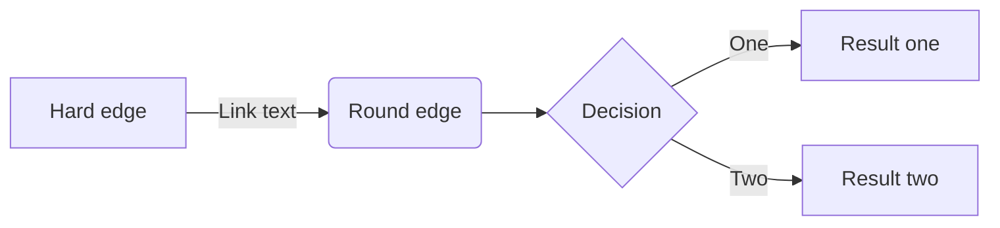
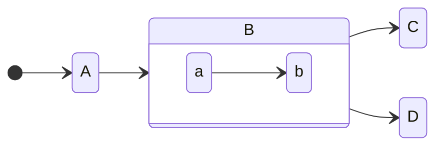
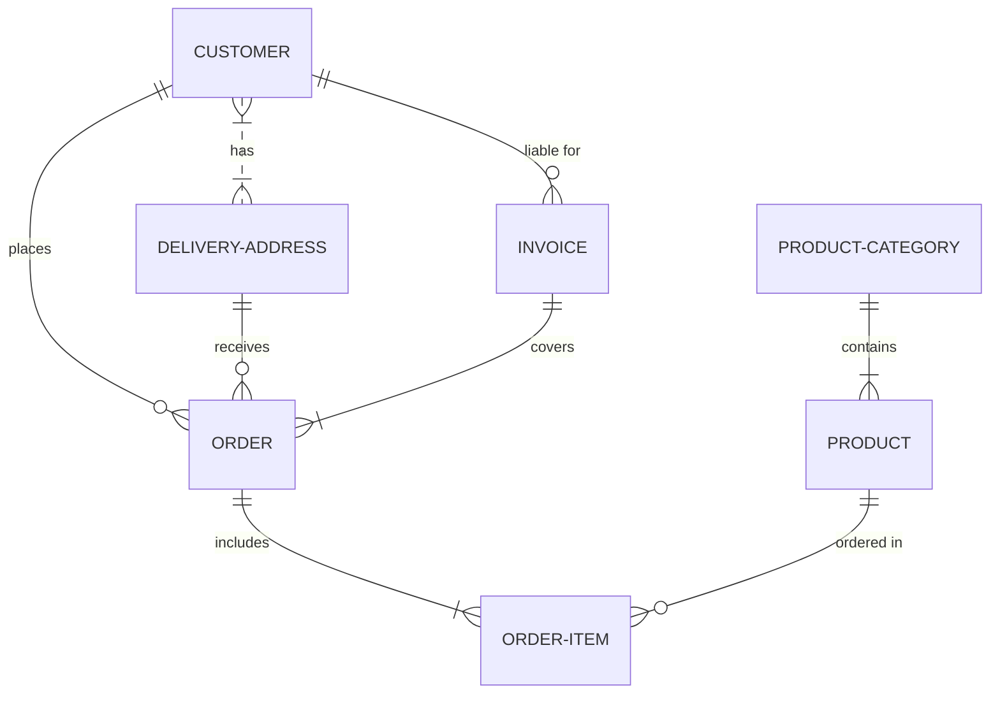

# Título

## 1. Descrição

Lorem Ipsum is simply dummy text of the printing and typesetting industry.

### 1.1. Problema

Lorem Ipsum is simply dummy text of the printing and typesetting industry. Lorem Ipsum has been the industry's standard dummy text ever since the 1500s, when an unknown printer took a galley of type and scrambled it to make a type specimen book. It has survived not only five centuries, but also the leap into electronic

### 1.2. Objetivo

Lorem Ipsum is simply dummy text of the printing and typesetting industry. Lorem Ipsum has been the industry's standard dummy text ever since the 1500s, when an unknown printer.

### 1.3. Escopo

Lorem Ipsum is simply dummy text of the printing and typesetting industry. Lorem Ipsum has been the industry's standard dummy text ever since the 1500s, when an unknown printer.

### 1.4. Modelagem de Processos

#### 1.4.1. Processo 1

## 2. Requisitos

### 2.1. Histórias de Usuários

| Persona _(Eu como...)_ | Ação _(quero/Preciso...)_         | Benefício _(para...)_             |
| ---------------------- | --------------------------------- | --------------------------------- |
| Gerente de Projetos    | Visualizar o avanço do Cronograma | Acompanhar o andamento do Projeto |

### 2.2. Lista de Requisitos

- [ ] lorem ipsum
- [ ] lorem ipsum
- [ ] lorem ipsum . . .

### 2.3. Fluxo do Usuário/Casos de Uso do Usuário

## 3. Interface

> Mockup aqui

## 4. Dados

### 4.2. ER

### 4.1. Campos

#### Tabela Entidade A

| Campo         | Tipo                                                                     | Restrições                                   | Valor default | Not Null |
| ------------- | ------------------------------------------------------------------------ | -------------------------------------------- | ------------- | -------- |
| nome_do_campo | Texto, Número, Data, Arquivo, Seleção única, Seleção Múltipla, Tabela... | Formato de Email, Exatamente 6 caracteres... |               |
